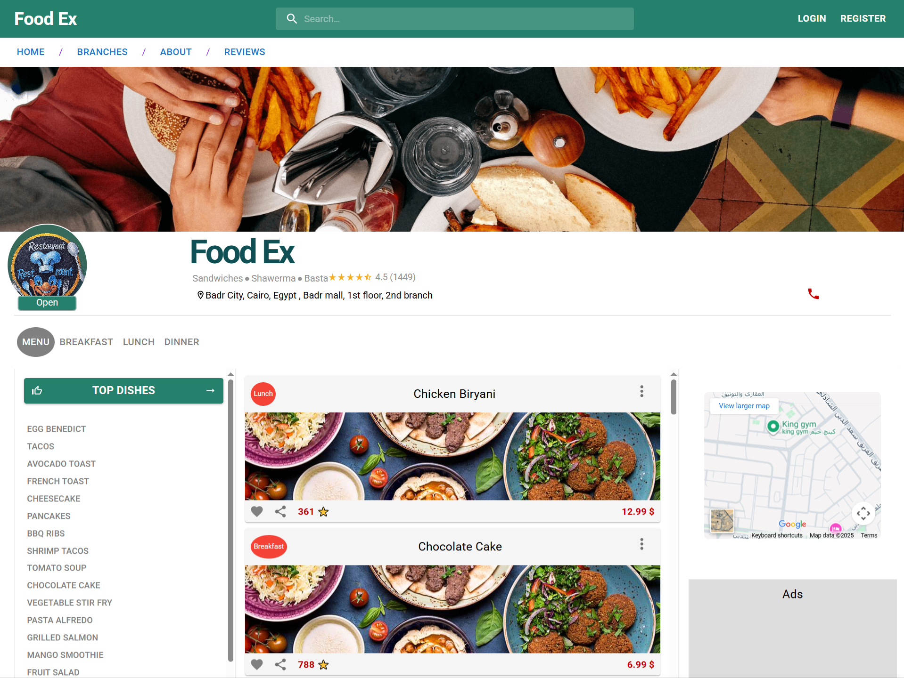
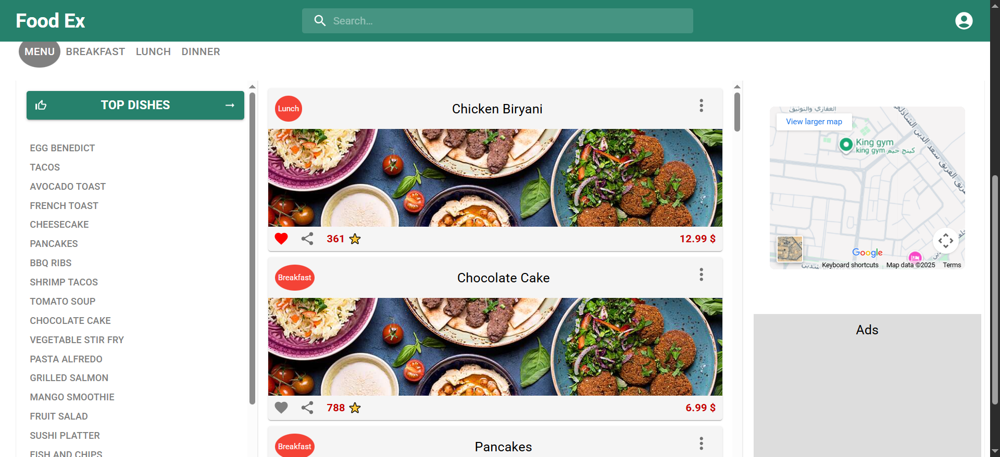
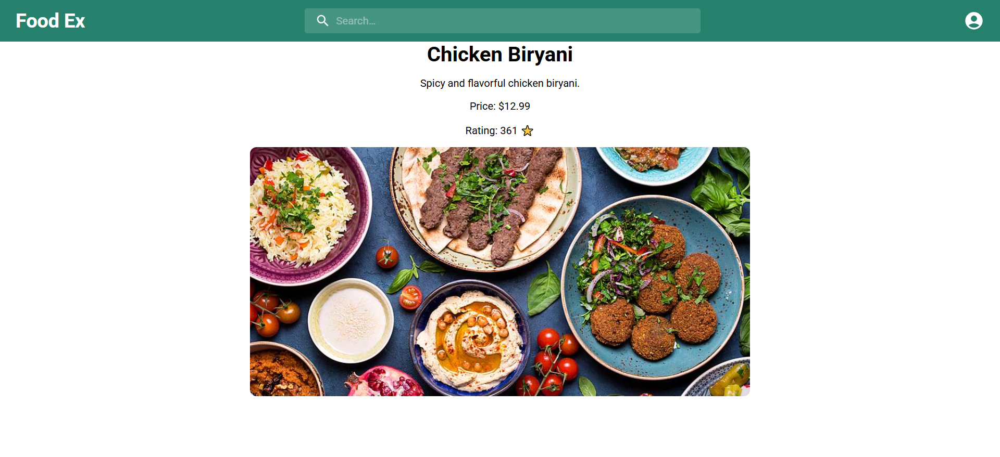
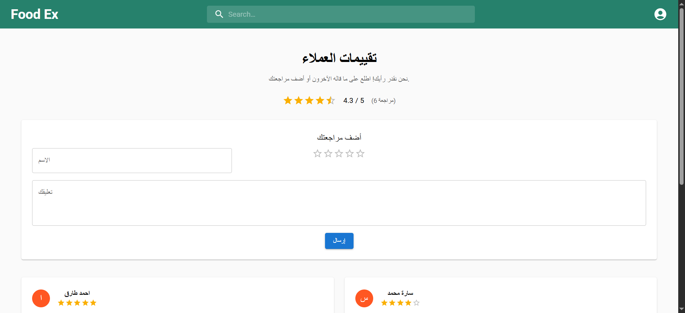

# 🍽️ Food Ex Website

A comprehensive restaurant management and dish display website built with React and Firebase.

## 📋 Description

Food Ex is a modern and responsive website for restaurant management and dish display. It allows users to browse dishes, search, add favorites, and manage the menu (for administrators). The website is built using React and Firebase for a smooth and secure user experience.

> **Note:** This README file has been organized and formatted with the assistance of artificial intelligence.

## 📸 Project Screenshots

### Home Page

*Main page displaying all available dishes with filtering options*

### Dish Details

*Detailed view of a specific dish with description, price, and rating*

### Admin Dashboard

*Administrator dashboard for managing dishes and menu items*

### User Authentication

*Login and registration interface for user authentication*

## ✨ Key Features

### For Users:
- 🔍 **Dish Search**: Quick search across all available dishes
- ⭐ **Rating System**: Display dish ratings
- ❤️ **Favorites**: Add and remove dishes from favorites list
- 🍽️ **Dish Filtering**: Filter by meal type (Breakfast, Lunch, Dinner)
- 📱 **Responsive Design**: Works on all devices
- 🔐 **Authentication System**: Login and registration using Firebase Authentication
- 📄 **Dish Details**: Dedicated page to display details of each dish

### For Administrators:
- 🛠️ **Dashboard**: Complete dashboard for dish management
- ➕ **Add Dishes**: Add new dishes with all details
- 📤 **Bulk Upload**: Upload all dishes from JSON file at once
- 🗑️ **Delete Dishes**: Delete all dishes from database
- 📊 **User Management**: Track user activity

## 🛠️ Technologies Used

### Frontend:
- **React** (^18.3.1) - JavaScript library for building user interfaces
- **React Router DOM** (^7.0.1) - Routing and navigation between pages
- **Material-UI (MUI)** (^6.1.9) - Ready-to-use UI component library
- **Emotion** (^11.13.5) - CSS-in-JS styling

### Backend & Database:
- **Firebase** (^11.7.3)
  - **Firestore** - Database
  - **Authentication** - Authentication
  - **Storage** - File storage

### Other Tools:
- **SweetAlert2** (^11.21.0) - Beautiful alert dialogs
- **React Scripts** (^5.0.1) - Build and development tools

## 📦 Installation & Setup

### Prerequisites:
- Node.js (version 14 or higher)
- npm or yarn
- Firebase account

### Installation Steps:

1. **Clone the project:**
```bash
git clone <repository-url>
cd "Food Ex Website by react"
```

2. **Install dependencies:**
```bash
npm install
```

3. **Setup Firebase:**

   - Create a new project in [Firebase Console](https://console.firebase.google.com/)
   - Get the configuration data (Firebase Config)
   - Create a `.env` file in the project root directory:
   
```env
REACT_APP_FODEX_FIREBASE_KEY=your_api_key
REACT_APP_FODEX_FIREBASE_AUTH_DOMAIN=your_auth_domain
REACT_APP_FODEX_FIREBASE_PROJECT_ID=your_project_id
REACT_APP_FODEX_FIREBASE_STORAGE_BUCKET=your_storage_bucket
REACT_APP_FODEX_FIREBASE_MESSAGE_ID=your_messaging_sender_id
REACT_APP_FODEX_FIREBASE_APP_ID=your_app_id
REACT_APP_FODEX_FIREBASE_MEASURMENT_ID=your_measurement_id
```

4. **Setup Firestore:**
   - In Firebase Console, go to Firestore Database
   - Create a database in production or test mode
   - Create the following collections:
     - `menu` - To store dishes
     - `users` - To store user data

5. **Run the project:**
```bash
npm start
```

The website will automatically open at `http://localhost:3000`

## 📁 Project Structure

```
Food Ex Website by react/
├── public/
│   ├── imgs/              # Public images
│   ├── index.html         # Main HTML file
│   └── manifest.json      # PWA settings
├── src/
│   ├── components/        # Main components
│   │   ├── About.js       # About page
│   │   ├── appBarComponent.js  # Top navigation bar
│   │   ├── Branches.js    # Branches page
│   │   ├── contact.js     # Contact page
│   │   ├── content.js     # Home page content
│   │   ├── Dishes.js      # Display dishes
│   │   ├── filterBtns.js  # Filter buttons
│   │   ├── foodWebsite.js # Main page
│   │   ├── Home.js        # Home page
│   │   ├── login.js       # Login page
│   │   ├── register.js    # Registration page
│   │   ├── MealDesc.js    # Dish details
│   │   ├── Reviews.js     # Reviews page
│   │   ├── searchContent.js  # Search results
│   │   ├── secondBar.js   # Secondary bar
│   │   ├── supFooter.js   # Footer
│   │   ├── MainDataContext.js  # Context API for state management
│   │   ├── mealsData.json # Default dishes data
│   │   └── rating.json    # Ratings data
│   ├── Dashbord/
│   │   └── adminDashbord.js  # Admin dashboard
│   ├── firebase/
│   │   ├── firebaseConfig.js  # Firebase configuration
│   │   └── dataBaseContext.js # Database context
│   ├── imgs/              # Component images
│   ├── App.js             # Main component
│   ├── App.css            # Main component styles
│   ├── index.js           # Entry point
│   └── index.css          # Global styles
├── package.json           # Dependencies file
└── README.md             # This file
```

## 🚀 Pages & Routes

| Route | Description |
|-------|-------------|
| `/` | Home page - Display all dishes |
| `/Login` | Login page |
| `/Register` | Create new account page |
| `/AdminDashbord` | Admin dashboard (requires permissions) |
| `/Branches` | Branches page |
| `/Reviews` | Reviews page |
| `/About` | About us page |
| `/Contact` | Contact page |
| `/SearchContent` | Search results page |
| `/dish/:id` | Dish details page |

## 💻 Available Commands

```bash
# Run the project in development mode
npm start
# or
npm run dev

# Build the project for production
npm run build

# Run tests
npm test

# Eject configuration files (irreversible)
npm run eject
```

## 🔧 Technical Features

### State Management:
- Using **Context API** for global state management
- Local storage using **localStorage** for temporary data
- Synchronization with **Firebase Firestore** for permanent data

### Security:
- Secure authentication using Firebase Authentication
- Protection of sensitive routes (dashboard)
- Automatic password encryption

### Performance:
- Asynchronous data loading
- Data caching
- Image and resource optimization

## 📝 Using the Dashboard

1. **Login as Administrator:**
   - Login with an account that has administrator permissions
   - Navigate to `/AdminDashbord`

2. **Add New Dish:**
   - Fill the form with all required data
   - Click the "Add" button

3. **Bulk Upload Dishes:**
   - Use the "Upload Dishes" button to upload all dishes from `mealsData.json` file

4. **Delete All Dishes:**
   - Use the "Delete Dishes" button (Warning: This operation cannot be undone)

## 🎨 Customization

### Changing Colors:
You can modify colors in CSS files:
- `src/App.css`
- `src/components/dR.css`
- `src/components/loginAndRegister.css`

### Adding Default Dishes:
Modify the `src/components/mealsData.json` file to add new dishes.

## 🐛 Troubleshooting

### Common Issues:

1. **Firebase Connection Error:**
   - Verify the configuration data in the `.env` file
   - Ensure Firestore is enabled in Firebase Console

2. **Dishes Not Appearing:**
   - Ensure there is data in the `menu` collection in Firestore
   - Check Firestore security rules

3. **Login Issues:**
   - Ensure Authentication is enabled in Firebase Console
   - Ensure email login method is enabled

## 🚀 Deployment


### Deployment Information:
- **Platform**: Vercel
- **Status**: Under development
- **Created By**: Mostafa Abdellraheem

### Contact Developer:
- **GitHub**: [MostafaAbelraheem2020](https://github.com/MostafaAbelraheem2020)
- **LinkedIn**: [Mostafa Mohamed](https://www.linkedin.com/in/mostafa-mohamed-63b87627a/)
- **WhatsApp**: [01010317417](https://wa.me/01010317417)

## 📄 License

This project is open source and available for free use.

## 👥 Contributors

- Project developed using React and Firebase

## 📞 Support

For support and inquiries, please open an issue in the repository.

---

**Developed with ❤️ using React and Firebase**
